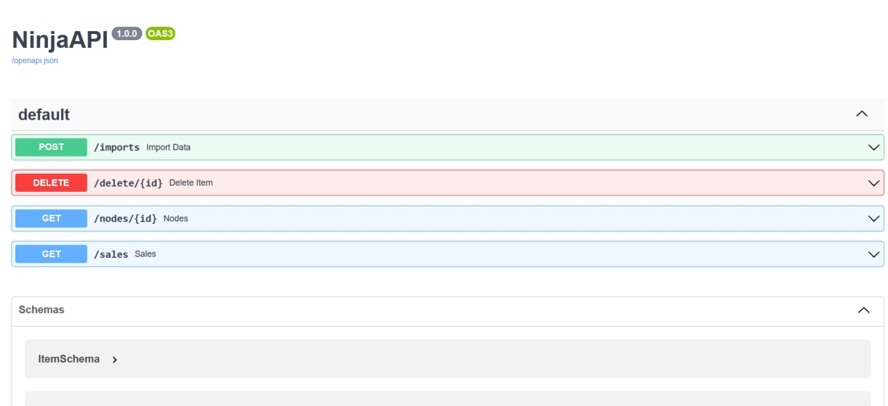

# Вступительное задание в летнюю школу backend-разработки Yandex #

## В проекте используются:

- Django
- <a href="https://github.com/vitalik/django-ninja">django-ninja</a>
- <a href='https://github.com/django-mptt/django-mptt'>django-mptt</a>
- Postgres
- Docker
- unittest

## Auto Swagger Docs

В проекте есть документация API, которая доступна по ссылке **'/docs'**

## Запуск проекта

    docker-compose up --build

## Запусков тестов

    docker-compose  run --rm  web python manage.py test

    или

    make test
